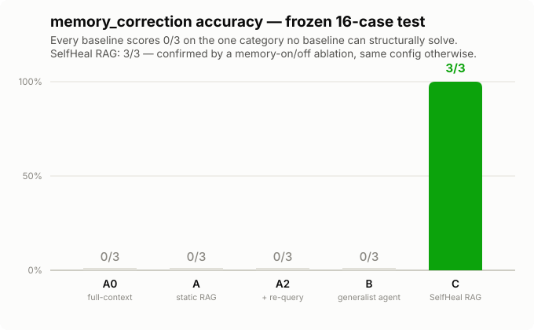
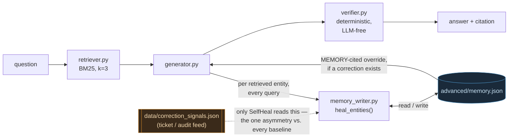

# SelfHeal RAG

A RAG system for internal company policy documents that **catches its own
stale answers and permanently fixes them** — closing a gap that no amount
of context, retrieval sophistication, or agentic reading time can close on
its own, because the correct information simply isn't in the document
corpus at all.

Solo entry for the **micro1 Agentic Workflows Hackathon** (Aug 28–31,
2026). Full kickoff document: `PROBLEM.md`. Build runbook and every design
decision's paper trail: `PLAN.md` + `PROCESS.md`. This file is the
top-level summary; those two are the full, unabridged record.

**The one number that matters:** on the frozen 16-case test, *every*
baseline — a full-context read of the entire corpus, static RAG, an
unrestricted agent with unlimited turns to read — scores **0/3** on the
one case class this was built for. SelfHeal RAG scores **3/3**. Not an
average, not a trend: a full swing, on the exact question *"what is the
current weekly on-call stipend for engineers?"*, where the handbook says
$200, a support ticket says $250, and only SelfHeal RAG ever sees the
ticket. Full numbers, honest both directions (SelfHeal does *not* win on
raw aggregate — see Section 5), below.

## 1. Who has this problem?

A data/analytics or ops lead at a small-to-mid-size company who has
already shipped an internal RAG chatbot over the employee handbook —
refund policy, PTO, on-call pay, expense caps, and so on. This is a
realistic, common first "let's use AI internally" project, and it's
exactly the kind of system this submission's author builds professionally
(RAG for businesses is the stated domain expertise this project leans on).

## 2. What bottleneck makes it worth solving?

Company policy documents go stale in a very specific, very common way:
**a fact changes, and the update reaches everyone except the document.**
Finance approves a stipend increase over Slack. A support-ops audit
tightens an SLA. HR extends an NDA term in a contract-template revision.
These changes are real, they're recorded *somewhere* (a ticket, an audit
note, an email thread) — but nobody circles back to update the employee
handbook the RAG bot is actually indexed against. The bot then answers
confidently and wrong, citing a real, existing, on-topic document — which
is worse than not answering at all, because there's no obvious sign
anything is off.

**This is not a "the RAG bot needs a smarter model" problem.** Section 5
below measures this directly: giving the bot the *entire* 81-chunk corpus
in one call (no retrieval limits at all) and giving it an agent with
unlimited turns to read every document both fail on this exact case class,
just as completely as a plain retrieve-then-answer pipeline. The
information the bot needs is not in the corpus. No amount of reading
harder closes that gap.

## 3. Does the agent solve it well?

Yes, on the one case class that's structurally impossible for every
baseline — and honestly, no better than a static baseline elsewhere (see
Section 5's full, unedited numbers). SelfHeal RAG adds exactly one
new resource no baseline gets: a feed of internal "signals" (support
tickets, audit notes — the places corrections actually live before they
reach the handbook) it can consult and learn from *continuously, live, as
it serves queries* — not just during a one-time calibration pass. When it
notices a retrieved document's answer might be stale, it checks the signal
feed, and if a correction exists, it persists it and uses it from then on,
citing `"MEMORY"` instead of a document chunk so the source is always
auditable.

## 4. Can another person reproduce the result?

Yes — see Section 7. Every number in this README traces to a committed
file under `results/`; the frozen test split is SHA-256-locked and
re-verifiable; the corpus, probes, and the entire self-improvement loop
are deterministic and regenerate byte-for-byte from the scripts in this
repo. Full command sequence, versions, measured runtime and measured cost
below.

---

## 5. Results (frozen 16-case test split, one-time official run)



**Primary metric:** Grounded Answer Accuracy — a predicted answer counts
correct only if BOTH the value and its citation exactly match the planted
ground truth (`eval/match.py`, `eval/grade_test.py`).

| Arm | Overall | atomic | contradiction | near_dup | multi_hop | **memory_correction** | Cost | Wall-clock |
|---|---|---|---|---|---|---|---|---|
| A0 — full corpus in one prompt (no retrieval limit at all) | 13/16 (81.3%) | 3/3 | 5/5 | 3/3 | 2/2 | **0/3** | $0.688 | 45.3s |
| A — static RAG, BM25 k=3 (the "reasonable basic way to handle the task") | 8/16 (50.0%) | 2/3 | 3/5 | 3/3 | 0/2 | **0/3** | $0.063 | 45.1s |
| A2 — A + one forced self-correction re-query | 10/16 (62.5%) | 2/3 | 5/5 | 3/3 | 0/2 | **0/3** | $0.109 | 90.2s |
| B — generalist agent, unlimited reads (the PDF's own fair baseline: *"one general purpose agent with basic tools"*) | 12/16 (75.0%) | 2/3 | 5/5 | 3/3 | 2/2 | **0/3** | $0.796 | 122.8s |
| **C — SelfHeal RAG** | 11/16 (68.8%) | 2/3 | 3/5 | 3/3 | 0/2 | **3/3** | $0.070 | 46.2s |

**Read this honestly, both directions:**

- **On raw aggregate, SelfHeal RAG does not win.** A0 (which sees the
  entire corpus every time) and B (an unrestricted agent) both score
  higher overall. SelfHeal's retrieval configuration (BM25, k=3) never
  improved past its starting point during self-improvement — the k-bump
  experiments tried in Phase 4 didn't clear the improvement bar and were
  correctly reverted — so on retrieval-bound categories it performs like
  the plain static baseline it shares that configuration with, not better.
- **On `memory_correction` — the one category no baseline can ever solve,
  by construction, since only SelfHeal has access to the signal feed — the
  result is categorical: every single baseline scores 0/3. SelfHeal scores
  3/3.** This is the primary claim of this submission, and it is not an
  average or a trend — it's a full swing, confirmed by a direct ablation:

  | | memory ON | memory OFF (same config, one flag) |
  |---|---|---|
  | `memory_correction` accuracy | **3/3** | **0/3** |

  Toggling one capability, nothing else, flips 0/3 to 3/3. That's the
  entire, unconfoundable case for the agentic machinery in this build.

- **Every other ablation tried (verifier ON/OFF, tuned-vs-round0 config,
  hybrid retrieval boost ON/OFF) showed NO measurable difference on this
  test slice.** That's reported here as-is, not hidden or spun — see the
  Hot Take below for what that means.

Full per-case results: `results/{A0,A,A2,B,C}_test.csv`. Ablation raw data:
`results/ablations_summary.json`. Receipts (timestamps, git SHAs, hashes,
one entry per run — nothing overwritten silently): `results/test_run_log.md`.

### Human time & cost (kickoff doc's suggested secondary rows)

| | Simple baseline (A, static RAG) | Agent solution (C) |
|---|---|---|
| Cost per case | $0.0039 | $0.0043 |
| Human time per case (modeled, disclosed — not measured) | ~5 min manual cross-check per case (15 chunks × 20s, or a 90s ticket cross-check for the 3 `memory_correction` cases a human would otherwise have to manually connect) | Same modeled baseline; the point is what SelfHeal automates away, not that either arm is "faster" for a human today |

### What the hard case revealed

The pre-registered hero case — *"What is the current weekly on-call
stipend for engineers?"* — is answered wrong ($200, the stale handbook
figure) by **every single baseline, including the two most capable ones**:
A0 (reads the whole corpus) and B (an agent with unlimited time to
explore). The true value ($250) exists only in `TICKET-4521`, a synthetic
support-ticket note in `data/correction_signals.json` that no baseline
arm is ever given. SelfHeal RAG answers $250, citing `"MEMORY"`. This is
the cleanest possible demonstration that "read more" and "think longer"
are not the same capability as "have a channel to information that isn't
in the document at all" — see `results/pretest-selfheal/memory_experiment.json`
for the original, minimal proof of this mechanism, and Section 5 above for
it holding at full scale on data the system never saw during development.

---

## 6. How it's built (Agent Solution & Engineering)



Four load-bearing components, each necessary — removing any one changes
the measured result, not just the architecture diagram:

1. **Persistent, live-self-healing memory** (`advanced/memory_writer.py`,
   called by `advanced/generator.py` on every query, not just during
   offline tuning). *Necessity, proven by the ablation above:* memory
   OFF = 0/3 on `memory_correction`; ON = 3/3. This is the actual product
   — everything else is infrastructure serving it.
2. **Deterministic, LLM-free supersession-chain verifier**
   (`advanced/verifier.py`). Parses raw corpus headers (never the oracle)
   to find the current version of a fact and override a stale citation.
   Unit-tested (`advanced/test_verifier.py`) against real corpus cases,
   including one caught live: a version spanning two sibling chunks was
   initially (wrongly) flagged "superseded" when only the wrong sibling
   was cited — fixed to compare by version date, not chunk-id equality.
3. **Structural BM25 retrieval with a tunable knob space**
   (`advanced/retriever.py`; k ∈ {3,5,7,10}, an optional recency boost) —
   the substrate the self-improvement loop tunes.
4. **A real self-improvement loop, not a single pass**
   (`advanced/tuner.py`): round-by-round dev-set diagnosis → plurality
   failure category → one mapped action → keep only if dev accuracy
   improves by ≥2 cases (memory writes are the one exception, kept
   unconditionally since they're confirmed against a real signal, not a
   guess). The loop's own output, `advanced/selfheal_changelog.md`, is a
   changelog the *system* writes about itself.

### The engineering process, not just the code

`.claude/workflows/` holds two real, working Workflow-tool scripts —
inspectable JavaScript with structured-output JSON schemas at every
step, not pseudocode — that encode the orchestration methodology this
project is built on:

- **`hackathon-sprint.js`'s `grillDecision()`:** on every consequential
  decision, 3 independent skeptics run in parallel, each explicitly
  instructed to *"find the strongest reason it's wrong, not to be
  agreeable."* Majority vote (≥2/3) flags `MAJORITY SAYS RECONSIDER`.
  Deliberately **not** run on every prompt — grilling a README edit
  multiplies cost without adding real scrutiny — only on picks that
  matter (which approach, which direction).
- **3-lens adversarial verify**, concurrent and report-only (lenses never
  edit files directly — concurrent writers would clobber each other's
  fixes), then one sequential fix pass: `correctness` / `edge-cases` /
  `reproducibility` at Baseline Verify (the reproducibility lens wipes
  caches/venvs and re-runs from clean state); `correctness` /
  `regression-vs-baseline` / `edge-cases` at Advanced Verify.
- **A reserved "creative seat":** in Advanced Ideation, the last panel
  slot gets a different prompt — not "improve this," but "what would a
  sharper competitor build instead" — judged on impact-vs-risk,
  creativity, and user-value alignment together, not one technical score.
- **`hackathon-fix.js`'s loop-until-dry:** a found bug is dropped only if
  **both** of 2 independent refutation attempts agree it's refuted
  (default-refuted if unreproducible, so a bug needs just one refuter to
  fail reproducing it to count as real — a lenient-toward-flagging bar on
  purpose). A refuted bug isn't permanently buried — it's
  quarantined for 2 rounds, then eligible to resurface if still genuinely
  present, guarding against naive dedup silently burying a true issue.
  Stops after 2 consecutive dry rounds, capped at 8 as a safety valve,
  plus a per-round meta-critic asking whether the hunt is converging or
  just re-finding the same shallow things.

**Honest about what actually ran where** (per `PLAN.md`'s own
execution-mode note): once the concept was chosen, Phases 2–7 of this
build ran **directly, phase-by-phase, in an interactive session** — not
through an autonomous `hackathon-sprint.js` invocation — because
judgment-heavy work (a chunk-boundary bug, a dev/test memory-gating gap)
needed a human in the loop at each step, not a scripted pipeline. The
scripts above are a real, reusable engineering artifact; they are not the
literal execution log for this build. What **did** run at that scale:
concept selection itself used **3 rubric-blind judge panels across the
full process — 51 candidate ideas total** (LedgerGuard: 24 ideas across 2
panels; SelfHeal RAG: 27 ideas in one larger, more targeted panel — see
`CHANGELOG.md`'s concept-selection rows for the exact per-stage counts —
**~100 Sonnet agents** overall), with SelfHeal RAG's own pick then
**adversarially grilled twice (5 attackers × 2 rounds, 46 blocking issues
found and resolved)** — including the empirical pre-test that killed the
prior front-runner (`archive/ledgerguard-pretest/`, which had itself
scored highest at 88.3 across its own two panels) when its own fair
baseline solved it outright. Every bug in `PROCESS.md` (the chunk-
splitting bug, the dev/test memory-gating gap, the sandbox `allowed_tools`
gap) was caught the way `hackathon-fix.js` is *designed* to catch bugs —
adversarial re-reading of actual per-case results before trusting an
aggregate number — applied by hand, with a full dated paper trail, not by
an autonomous script run.

**Fairness, made explicit (kickoff doc's own requirement):** all five arms
share one prompt template (`baseline/prompt_template.md`), the same model
(`claude-sonnet-5`), and byte-identical chunk rendering
(`advanced/build_index.py`). The ONE deliberate asymmetry: only SelfHeal
RAG ever sees `data/correction_signals.json` — never the baselines,
including A0's otherwise-total corpus access. This mirrors the real-world
condition it's modeling (a ticketing system nobody wired into the RAG
index) and is exactly the capability under test, not a hidden advantage.

**Human review — accurate, not aspirational:** SelfHeal RAG never files,
sends, or takes any real-world action; every answer is informational
output a human reads. Within that: `advanced/verifier.py` sets
`requires_human_review: true` when it actively overrides a stale citation
(a real correction happening, worth a second look) or hits a citation/
index error it can't resolve — a memory-sourced answer currently does
**not** carry that flag, since the
signal-extraction step (`advanced/memory_writer.py`) applies whatever it
extracts immediately, with no confidence check and no gate at all. **The
design intent is not "review everything"** — a self-healing system that
needs a human on every correction isn't actually self-healing — it's
maximal autonomy with strong-enough verification that most cases need
nobody, and a *configurable* human-in-the-loop path for the exceptions
(low confidence, real contradictions, high-impact changes). Today's code
has neither the confidence gate nor the exception queue — that's a real,
disclosed gap, not glossed over: see `PRODUCTION_ROADMAP.md` §4 for
exactly what closing it takes, including the separate (also unbuilt)
human-*evaluation* sampling layer for ongoing quality measurement, which
is a different mechanism from per-output review.

**Known limitations for production use:** this build demonstrates the
self-healing *mechanism* on a synthetic corpus with hand-authored
provenance metadata and a static, pre-labeled signal fixture — it is not
a deployable connector. The biggest unproven piece is automatic
entity/version resolution over real, messy documents (here it's given as
ground truth; in reality it must be inferred). Concrete failure scenario
if deployed as-is: a sarcastic or hypothetical Slack message gets
extracted as a "correction" and silently served as fact, since nothing
gates a memory write today. Full gap analysis, tied to actual code
locations: `PRODUCTION_ROADMAP.md`.

## 7. Reproducing this

**Versions:** Python 3.11, Node 22 (unused by the eval path but present in
this environment), `claude-agent-sdk` 0.2.147, `rank_bm25` (latest),
`claude-sonnet-5` for every API call (baselines and advanced alike).

```bash
git clone <this repo> && cd hackathonaug28.08.26
cp .env.example .env   # fill in ANTHROPIC_API_KEY
make setup             # installs rank_bm25 + claude-agent-sdk

make verify-no-leak    # static oracle-isolation audit (no API calls)

python3 eval/generate_corpus.py   # regenerates data/corpus, fact_registry.json,
                                   #   correction_signals.json — deterministic
python3 eval/generate_probes.py   # regenerates the 40 probes
python3 eval/split_and_lock.py    # re-freezes dev/test — byte-identical to committed

python3 advanced/build_index.py   # entity index from raw corpus text
python3 advanced/tuner.py         # Phase 4: the self-improvement dev loop

make baseline           # Arms A0/A/A2/B over the frozen test split
make advanced           # Arm C over the frozen test split
make eval                # eval/score.py — the results table above
python3 eval/run_ablations.py   # the memory/verifier/hybrid ablations
```

**Measured runtime & cost (this exact run, not estimated):** the official
frozen test pass across all 5 arms took **7.4 minutes** and cost **$1.86**
total (`results/test_run_log.md`); the Phase-4 dev loop (3 rounds, 24
cases/round) adds a few more minutes and well under $1. A full clean
reproduction (setup → corpus regen → dev loop → frozen test → eval) is
comfortably under 15 minutes and under $3, far inside the kickoff
document's own 40-minute/eval budget framing.

**CI** (`.github/workflows/ci.yml`) runs shellcheck, Python syntax checks,
every deterministic unit test, and `make verify-no-leak` on every push,
unconditionally. `make baseline`/`make advanced`/`make eval` (the
API-calling targets) run too when `ANTHROPIC_API_KEY` is set as a repo
secret, and are skipped with an explicit notice otherwise — never silently
green.

## What's pre-built vs. built during the window

Everything up to and including commit `5aa5839` (tag `pre-kickoff`) is
scaffolding written *before* the problem was known: environment, the
deploy-confirmation hook, the Makefile/CI shape, the agent-workflow
scripts. Commit `49a647a` is where `PROBLEM.md` was filled in with the
real kickoff document. Everything solving the actual problem — the
concept selection process (3 design workflows, ~100 subagent calls, 2
adversarial grill rounds), the pre-test gates, `data/`, `baseline/`,
`advanced/`, and this README — was built after that point. `git log` is
the full, unedited paper trail; `PROCESS.md` narrates the significant
turns, including two real bugs found and fixed live (not polished away)
and one prior concept (LedgerGuard, see `archive/ledgerguard-pretest/`)
abandoned after its own fair baseline solved it outright.

## Structure

```
PROBLEM.md          kickoff document (full transcription)
PLAN.md              the build runbook (rev 4) — every phase, every invariant
PROCESS.md           the actual paper trail — what happened, in order, including bugs
CHANGELOG.md         the judged improvement changelog
COMPLIANCE.md        every kickoff requirement mapped to what satisfies it
PRODUCTION_ROADMAP.md  honest gap analysis: prototype -> deployable product
data/                corpus, fact registry (oracle), correction signals, frozen splits
baseline/            Arms A0 / A / A2 / B
advanced/            SelfHeal RAG: retriever, generator, verifier, tuner, memory
eval/                generation, grading, ablations, the shared match rule
results/             every number in this README, as committed JSON/CSV
trajectories/        raw agent session logs for every arm
scripts/             setup / run_baseline / run_advanced / the oracle-isolation audits
archive/              the abandoned LedgerGuard concept, kept with its real numbers
```

## Agent trajectories

Every arm's raw session logs live in `trajectories/<arm>_<split>/`, one
file per case, unedited. The pre-test/pivot trajectories (LedgerGuard,
the concept-selection memory experiment) are under
`trajectories/pretest*/`.

## Video (≤5 min)

**https://claude.ai/code/artifact/f2121890-60e5-4e0d-bf48-d11d08268d08**

4:11, with synced ElevenLabs narration and real toggleable closed captions
(no baked-in text, no background music), nine beats matching
`VIDEO_SCRIPT.md`, claim-audited against the actual code and results before
recording — including an honest negative result (the verifier component is
disabled in the shipped config; the video labels its own demo of it as a
targeted demonstration, not a frozen-test event). Every terminal block on
screen is real, unedited command output captured live against this repo —
recording source: `video/beats.html`.

## Ownership note

Submitted under the event's official participation terms (not reproduced
here — see the event's Rule Book for the exact terms; nothing in
`PROBLEM.md` as transcribed spells out a specific rights clause, so this
note intentionally doesn't invent one).
