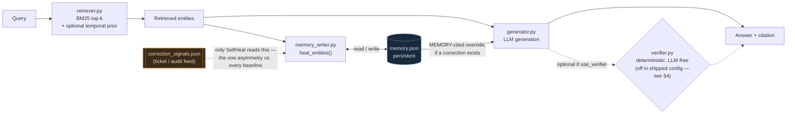
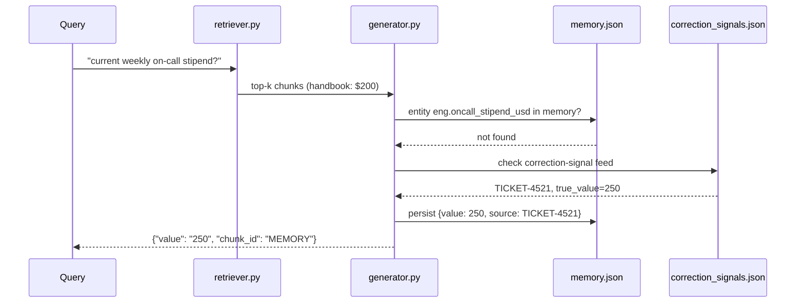

# SelfHeal RAG

Correction-aware, stateful retrieval-augmented generation for enterprise
knowledge that changes faster than the documents describing it.

[Demo](#demo) ·
[Architecture](#2-system-architecture) ·
[Quick start](#8-reproducing-this)

---

## 1. What it is

SelfHeal RAG combines BM25 sparse retrieval, a persistent entity-scoped
correction memory, a deterministic supersession verifier, and a
failure-taxonomy-driven self-improvement loop to close a specific,
structural RAG failure: the correct answer is *categorically absent* from
the indexed corpus and reachable only through an external correction
signal (a ticket, an audit note) that a standard retrieve-then-generate
pipeline never connects to. Concretely, this targets a data/analytics or
ops lead running an internal RAG chatbot over an employee handbook —
refund policy, PTO, on-call pay, expense caps — where a fact changes
(Finance approves a raise over Slack, an audit tightens an SLA) and the
update reaches everyone except the document the bot is indexed against. It
then answers confidently, wrong, and citing a real document — worse than
not answering, because nothing signals it's stale.

**The mechanism, in one number:** on a frozen 16-case test, every baseline
— full-context, static RAG, self-correcting RAG, a search-capable agent —
scores **0/3** on `memory_correction`, the category this was built for.
SelfHeal RAG scores **3/3**, reproduced by a single-flag memory ON/OFF
ablation. Full numbers, including where SelfHeal does *not* win (raw
aggregate), in [Section 6](#6-results).

### Demo

<video src="https://github.com/user-attachments/assets/af85d5fd-8e7d-4ea8-8a30-2c0806af9c2c" width="100%" controls></video>

## 2. System architecture



**Query lifecycle for the hero case** (`memory_correction-01`: handbook
says $200, `TICKET-4521` says $250):



## 3. Algorithms & mechanisms

**Sparse retrieval — Okapi BM25.** `retriever.py` is a standard lexical
retriever (`rank_bm25.BM25Okapi`, `k=3` by default):

```
S_BM25(q,d) = Σ_{t∈q} IDF(t) · f(t,d)(k1+1) / (f(t,d) + k1(1-b+b·|d|/avgdl))
```

with an optional entity-local temporal prior, toggled by
`hybrid_date_boost`:

```
S(d,q) = S_BM25(d,q) + λ · r_e(d),   λ = 0.5
```

where `r_e(d)` is `d`'s zero-indexed chronological rank among versions of
the same entity — a later version needs to out-lexically-match only
*other entities*, not out-score its own superseded predecessor. **This
knob is off in the shipped config** (`hybrid_date_boost: false` in
`advanced/final_config.json`) — the frozen-test numbers in §6 use plain
BM25.

**Persistent, entity-scoped correction memory.** `memory_writer.py`
checks every retrieved entity against `memory.json`; for any entity with
no entry yet, it consults `correction_signals.json` and, if a signal
exists, extracts a value via one LLM call and persists it:

```
M_{t+1}(e) = M_t(e)              if e ∈ M_t
           = Extract(s_e)         if e ∉ M_t and a signal s_e exists
           = ∅                    otherwise
```

Generation then composes the base prompt with any matching memory entry,
which overrides the document excerpt and is cited `"MEMORY"`:

```
P = P_base(q, R_k(q)) ⊕ M(E_R)
```

This runs on **every query** (`generator.py`, `use_memory=True`), not only
during offline tuning — the live-heal path exists specifically because
the offline-only version undercounted test-split entities (§7, main
failure mode).

**Deterministic temporal verifier — real, tested, disabled in the reported configuration.**
`verifier.py` builds an entity index `e → {d_1, ..., d_n}` from parsed
corpus headers and finds each entity's current version:

```
d*_e = argmax_{d ∈ D_e} effective_date(d)
```

If a citation's version predates `d*_e`, the verifier deterministically
overrides it with the current value and sets `requires_human_review`.
No model call, no guessing — and unit-tested against corpus cases
(`advanced/test_verifier.py`). **It is disabled in the shipped config**
(`use_verifier: false`) because the explicit verifier-ON ablation
(`results/ablations_summary.json`) changed **zero** outputs across all 16
frozen-test cases. Kept in the repo and demonstrated in the video as a
real, working, negative result — not claimed as load-bearing.

**Failure-taxonomy-driven self-improvement.** `eval/taxonomy.py` classifies
every dev-split failure into one of six categories (priority order):
`memory_correction_missed > retrieval_miss > hallucinated_citation >
wrong_override > stale_value_uncaught > wrong_value_other`. Each round,
`advanced/tuner.py` takes the plurality category and a mapped action:

```
c_t = argmax_c N_t(c)          (plurality failure category)
a_t = π(c_t)                    (mapped action: memory consult / k-bump / verifier-on / hybrid-on)
```

and keeps the change only if it clears a minimum effect size, with one
explicit exception:

```
θ_{t+1} = θ'_t   if Correct(θ'_t) − Correct(θ_t) ≥ 2, OR a memory write occurred
        = θ_t    otherwise
```

Memory writes are kept unconditionally (confirmed against an explicit,
source-backed correction signal, not a guess); everything else needs a
≥2-case dev-accuracy improvement.
The loop's own output, `advanced/selfheal_changelog.md`, is a changelog
the *system* writes about itself.

## 4. The self-healing path (pseudocode)

```python
for entity in retrieved_entities:
    if entity not in memory:
        signal = correction_signals.get(entity)      # only SelfHeal reads this
        if signal:
            value = llm_extract(signal.text)          # one LLM call
            memory[entity] = {"value": value, "source": signal.id}

if any(e in memory for e in retrieved_entities):
    prompt += memory_addendum(matches)                # cited "MEMORY", overrides doc excerpts

answer = llm_generate(prompt)

if use_verifier:                                       # False in the shipped config
    answer = verifier.check(answer, entity_index)      # deterministic, no model call
```

## 5. Evaluation

**Primary metric — Grounded Answer Accuracy (GAA).** A predicted answer
counts correct only if both the value *and* its citation match the
planted ground truth (`eval/match.py`):

```
GAA = (1/N) Σ_i 1[ match(ŷ_i, y_i) ∧ (ĉ_i = c_i) ]
```

Citing the right value from the wrong chunk — or the right chunk with a
misread value — scores zero. This is stricter than value-only accuracy on
purpose: a correct-looking wrong-citation is exactly the failure mode a
company can't afford to trust silently.

**Frozen 16-case test, entity-disjoint from the 24-case dev split** (both
SHA-256-locked, `eval/split_and_lock.py`), across 5 categories: `atomic`,
`contradiction`, `near_dup`, `multi_hop`, `memory_correction`.

**Oracle isolation** (`make verify-no-leak`, static, no API calls): the
frozen split and `data/fact_registry.json` (the ground-truth oracle) are
never read by any arm's runtime code — only by the grading script.

**Baselines**, all sharing one prompt template, one model
(`claude-sonnet-5`), byte-identical chunk rendering:

| Arm | Description | Given |
|---|---|---|
| A0 | Full 81-chunk corpus, one call | Everything except `correction_signals.json` |
| A | Static RAG, BM25 k=3 | Top-3 retrieved chunks |
| A2 | A + one forced self-correction re-query | Top-3 + a second angled re-query |
| B | Sandboxed generalist agent (`Read`/`Grep`/`Glob` only, no `Bash`/`Write`/`Edit`, 25-turn/8-min cap) | Full read access to a copy of `data/corpus/` |
| **C** | **SelfHeal RAG** | Retrieval + `correction_signals.json` (the one deliberate asymmetry) |

**Ablations** (`eval/run_ablations.py`): memory ON/OFF (primary),
verifier ON/OFF, tuned-vs-round0 config, hybrid-date-boost ON/OFF
(secondary) — all reported in §6, including the ones that showed no
effect.

## 6. Results

**Memory-correction proof-of-mechanism: 3/3 vs 0/3.**


| Arm | Overall | atomic | contradiction | near_dup | multi_hop | **memory_correction** | Cost | Wall-clock |
|---|---|---|---|---|---|---|---|---|
| A0 — full corpus in one prompt | 13/16 (81.3%) | 3/3 | 5/5 | 3/3 | 2/2 | **0/3** | $0.688 | 45.3s |
| A — static RAG, BM25 k=3 | 8/16 (50.0%) | 2/3 | 3/5 | 3/3 | 0/2 | **0/3** | $0.063 | 45.1s |
| A2 — A + one forced re-query | 10/16 (62.5%) | 2/3 | 5/5 | 3/3 | 0/2 | **0/3** | $0.109 | 90.2s |
| B — sandboxed generalist agent | 12/16 (75.0%) | 2/3 | 5/5 | 3/3 | 2/2 | **0/3** | $0.796 | 122.8s |
| **C — SelfHeal RAG** | 11/16 (68.8%) | 2/3 | 3/5 | 3/3 | 0/2 | **3/3** | $0.070 | 46.2s |

**Read this honestly, both directions:**

- **On raw aggregate, SelfHeal RAG does not win.** A0 (entire corpus every
  call) and B (a search-capable agent) both score higher overall.
  SelfHeal's retrieval config (BM25, k=3) never improved past its starting
  point during self-improvement — k-bump trials didn't clear the +2-case
  bar and were correctly reverted — so on retrieval-bound categories it
  performs like the static baseline it shares that config with, not better.
- **On `memory_correction` — the one category no baseline can solve by
  construction, since only SelfHeal has the signal feed — the result is
  categorical:** every baseline 0/3, SelfHeal 3/3, confirmed by a direct
  ablation:

  | | memory ON | memory OFF (same config, one flag) |
  |---|---|---|
  | `memory_correction` accuracy | **3/3** | **0/3** |

  One capability, nothing else changed, flips 0/3 to 3/3 — for this
  category. This ablation isolates the measured contribution of memory on
  this synthetic slice (N=3); it is not a claim about overall system
  accuracy, and not a large-sample statistical result.
- **Every other ablation (verifier ON/OFF, tuned-vs-round0, hybrid
  ON/OFF) showed no measurable difference on this test slice.** Reported
  as-is — see [§9 Limitations](#9-limitations) and §3's verifier note for
  what that means.

Full per-case results: `results/{A0,A,A2,B,C}_test.csv`. Ablation raw
data: `results/ablations_summary.json`. Run receipts (timestamps, git
SHAs, hashes): `results/test_run_log.md`.

**The hero case:** `memory_correction-01` ("current weekly on-call
stipend?") is answered wrong ($200) by every baseline, including the two
most capable — A0 (full corpus) and B (search-capable agent). The true
value ($250) exists only in `TICKET-4521`, never given to any baseline.
See `results/pretest-selfheal/memory_experiment.json` for the original
minimal proof of this mechanism, pre-scale.

**Human time & cost** (kickoff doc's suggested secondary rows):

| | Simple baseline (A, static RAG) | Agent solution (C) |
|---|---|---|
| Cost per case | $0.0039 | $0.0043 |
| Human time per case (modeled, disclosed — not measured) | ~5 min manual cross-check (15 chunks × 20s, or a 90s ticket cross-check for `memory_correction` cases) | Same modeled baseline — the point is what SelfHeal automates away, not raw speed |

### Improvement Changelog

The project kept the experiment history visible rather than presenting only the final configuration. The compact version below is the submission-facing summary; [`CHANGELOG.md`](CHANGELOG.md) contains the full experiment-by-experiment record.

| Stage | What changed | Evidence | Decision / learning |
|---|---|---|---|
| Single-shot QA pre-test | Tested whether stronger context/agentic reading alone produced a meaningful QA gap | A0=6/6 and B=6/6 on two successive gates | **Retargeted.** Raw model capability erased the intended gap; the project moved to the cross-session memory hypothesis. |
| Cross-session memory pre-test | Put the correction outside the document corpus and supplied it only through persisted memory | No memory → $200; memory → **$250**; fresh no-memory control → $200 | **Adopted.** This isolated the information-access failure the final system targets. |
| Dev loop: memory correction | On the plurality failure category, persisted five source-backed correction entries | Dev GAA **17/24 → 21/24 (+4)** | **Kept.** Memory cleared the configured +2-case improvement threshold. |
| Dev loop: retrieval tuning | Tried BM25 `k=3→5`, then `k=3→7` for remaining retrieval misses | Each trial reached 22/24, only +1 over the current best | **Reverted.** Both changes failed the predeclared +2-case keep rule. |
| Frozen final evaluation | Compared A0/A/A2/B/C and ran memory/verifier/tuning/hybrid ablations | Aggregate: A0 13/16, B 12/16, C 11/16. `memory_correction`: all baselines 0/3, C 3/3; memory-OFF returns C to 0/3. Secondary ablations changed zero test outputs. | **Contribution scoped to memory.** The reported held-out gain is the persistent correction-memory mechanism on the synthetic memory slice, not verifier/retrieval tuning or overall benchmark superiority. |

## 7. Engineering discipline behind the numbers

**Fairness, made explicit** (kickoff doc's own requirement): all five arms
share one prompt template, one model, byte-identical chunk rendering. The
one deliberate asymmetry — only SelfHeal ever sees
`correction_signals.json` — mirrors the real-world condition being
modeled (a ticketing system nobody wired into the RAG index) and is
exactly the capability under test, not a hidden advantage.

**Human review, accurately scoped:** SelfHeal RAG never files, sends, or
takes real-world action — every answer is informational output a human
reads. `verifier.py` sets `requires_human_review: true` on an active
override or an unresolvable citation error; a memory-sourced answer
currently does **not** carry that flag, since `memory_writer.py` applies
whatever it extracts immediately, with no confidence check. The design
intent is maximal autonomy with strong-enough verification that most
cases need nobody — not "review everything," which would defeat the point
of self-healing. Today's code has neither a confidence gate nor an
exception queue for that; see `PRODUCTION_ROADMAP.md` §4.

**Main failure mode (from `CHANGELOG.md`):** the first frozen-test run
tied the static baseline — 0/3 on `memory_correction`, the exact category
this was built for — because the self-improvement loop only ever
discovered corrections for dev-split entities, and the frozen test split
is deliberately entity-disjoint from dev. The fix (a live per-query heal
path, not just an offline calibration pass) is what actually produced the
categorical 0/3 → 3/3 result reported in §6.

**Hot take:** a held-out test split doesn't just measure generalization —
it will catch you gating a capability to the wrong scope, silently, as a
disappointing number rather than a stack trace. That's a stronger argument
for rigorous evaluation than any accuracy number by itself.

**How this was built:** concept selection used 3 rubric-blind judge
panels (~100 subagent calls total, 51 candidate ideas), with the chosen
concept adversarially grilled twice (5 attackers × 2 rounds, 46 blocking
issues resolved) before any product code was written — including killing
a prior front-runner concept (`archive/ledgerguard-pretest/`) after its
own fair baseline solved it outright. Full paper trail, every decision
dated: `PROCESS.md`, `PLAN.md`. Every kickoff requirement mapped to what
satisfies it: `COMPLIANCE.md`.

## 8. Reproducing this

**Versions:** Python 3.11, `claude-agent-sdk` 0.2.147 (recorded),
`claude-sonnet-5` for every API call. `rank_bm25`'s version was never
pinned or recorded at build time — a reproducibility limitation, disclosed
rather than guessed; `pip install rank_bm25` resolves to whatever is
current at install time.

```bash
git clone https://github.com/yonilev2003/SelfHealRag.git && cd SelfHealRag
cp .env.example .env   # fill in ANTHROPIC_API_KEY
make setup

make verify-no-leak    # static oracle-isolation audit, no API calls

python3 eval/generate_corpus.py   # regenerates data/corpus, fact_registry.json,
                                   #   correction_signals.json — deterministic
python3 eval/generate_probes.py   # regenerates the 40 probes
python3 eval/split_and_lock.py    # re-freezes dev/test — byte-identical to committed

python3 advanced/build_index.py   # entity index from raw corpus text
python3 advanced/tuner.py         # Phase 4: the self-improvement dev loop

make baseline           # Arms A0/A/A2/B over the frozen test split
make advanced           # Arm C over the frozen test split
make eval                # eval/score.py — the results table above
python3 eval/run_ablations.py   # the memory/verifier/hybrid ablations
```

**Determinism, precisely:** corpus generation, the dev/test split, grading,
and hashing are deterministic and regenerate byte-for-byte
(`make verify-no-leak` checks this statically). Live LLM inference is
not guaranteed deterministic call-to-call — the *committed* results under
`results/` are the reproducible artifact; a fresh live run may vary in
individual predictions even with an identical prompt and `max_turns=1`.

**Measured runtime & cost** (this exact run, not estimated): the official
frozen-test pass across all 5 arms took **7.4 minutes** and cost **$1.86**
total (`results/test_run_log.md`); the Phase-4 dev loop adds a few more
minutes and well under $1. Full clean reproduction: comfortably under 15
minutes and under $3.

**CI** (`.github/workflows/ci.yml`): shellcheck, Python syntax checks,
every deterministic unit test, and `make verify-no-leak` on every push,
unconditionally. The API-calling targets run when `ANTHROPIC_API_KEY` is
set as a repo secret, and are skipped with an explicit notice otherwise.

## 9. Limitations

- Synthetic corpus with hand-authored provenance metadata — not a
  deployable connector.
- Frozen test N=16; the `memory_correction` slice is N=3. A dramatic-
  looking 0/3→3/3 flip is still 3 data points — treat it as a clean
  mechanism proof, not a large-sample statistical claim.
- The correction channel's entities are pre-associated with known keys
  (`correction_signals.json`'s `entity_key` matches the corpus taxonomy
  exactly) — real entity/version resolution over messy documents is
  unimplemented; see `PRODUCTION_ROADMAP.md` §2–3.
- This demonstrates correction propagation from a known signal to a known
  entity — **not** autonomous, general staleness detection across
  arbitrary retrieved content.
- The verifier is real and unit-tested, but showed zero held-out impact
  and is disabled in the reported configuration (§3, §6) — kept and
  disclosed as a negative result, not counted as a contribution.
- SelfHeal does not lead on raw aggregate accuracy (§6) — its advantage is
  categorical and scoped to `memory_correction`.
- No confidence gate or human-exception queue on memory writes today
  (§7) — a real deployment needs one before autonomous writes are safe
  for HR/legal/finance content.

## 10. Repository map

| Path | Purpose |
|---|---|
| `advanced/` | SelfHeal RAG: `retriever.py`, `generator.py`, `verifier.py`, `memory_writer.py`, `tuner.py` |
| `baseline/` | Arms A0 / A / A2 / B |
| `data/` | Corpus, fact registry (oracle), correction signals, frozen dev/test splits |
| `eval/` | Corpus/probe generation, grading, ablations, the shared match rule, taxonomy classifier |
| `results/` | Every number in this README, as committed JSON/CSV |
| `trajectories/` | Per-arm/per-case eval logs (`{A0,A,A2,B,C}_test/`, one file per case, 16 cases each — A2 has 32, two turn traces per case), `pretest*/`; `raw/` holds interactive build-session logs (currently two sessions + `MANIFEST.md`) — see `trajectories/README.md` |
| `scripts/` | `setup` / `run_baseline` / `run_advanced` / oracle-isolation audits |
| `archive/` | The abandoned LedgerGuard concept, kept with its real numbers |
| `video/` | Demo video source (`beats.html`), narration, build/QA scripts |
| `.claude/workflows/` | Workflow-tool scripts encoding this build's orchestration methodology (Phases 2–7 ran interactively, not through these scripts — §7) |
| `PROBLEM.md` | Kickoff document (full transcription) |
| `PLAN.md` | Build runbook (rev 4) — every phase, every invariant |
| `PROCESS.md` | The actual paper trail — what happened, in order, including bugs |
| `CHANGELOG.md` | The judged improvement changelog |
| `COMPLIANCE.md` | Every kickoff requirement mapped to what satisfies it |
| `PRODUCTION_ROADMAP.md` | Honest gap analysis: prototype → deployable product |
| `AGENTS.md` | Tool-agnostic orientation for any coding agent picking this up |

## 11. Production direction

Path to a real deployment, in order: multi-format ingestion connectors →
ACL/permission-aware indexing → automatic entity/version resolution (a key
unbuilt production capability, not the retrieval or self-heal loop) → confidence-gated
autonomy with a human-exception queue → observability/QA sampling → a
larger, continuously-updated eval set. Full gap analysis, tied to exact
code locations: `PRODUCTION_ROADMAP.md`.

## 12. Hackathon provenance

Built for the **micro1 Agentic Workflows Hackathon** (Aug 28–31, 2026).
Everything up to commit `5aa5839` (tag `pre-kickoff`) is scaffolding
written before the problem was known; `PROBLEM.md` was filled in at
`49a647a`; everything solving the actual problem was built after that —
`git log` is the unedited paper trail. Kickoff requirements ↔ what
satisfies each: `COMPLIANCE.md`. Full engineering-process record (judge
panels, adversarial grilling, the Workflow-tool scripts, every dated
decision): `PLAN.md`, `PROCESS.md`. Demo video: `VIDEO_SCRIPT.md`.

## Ownership note

Submitted under the event's official participation terms (not reproduced
here — see the event's Rule Book for the exact terms; nothing in
`PROBLEM.md` as transcribed spells out a specific rights clause, so this
note intentionally doesn't invent one).
